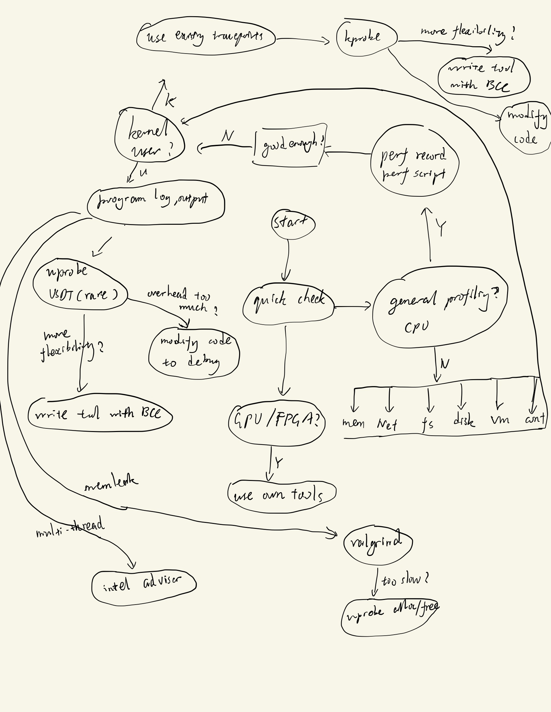

# A poor summary of profiling methods

**!!!WIP!!!**

This repo is a poor and incomplete summary and guide for profiling methods/tools and some background knowledge. It is for the purpose of personal collection only thus limited by my knowledge/skill and information collection ability. Also I am by no way able to learn and use all methods mentioned, as it's mainly a summary for later reference.

It's written as notes first but later I guess it's a good idea to organize the summary as markdown files with git history, so here it goes.

## Background

This page summaries background tracing/profiling event sources. These sources are how the profiling tools get the information, from kernel subsystem, compiler support and/or hardware. A few many be directly used by users but it's recommended to use a front-end tool instead.
- [Event Sources Summary on Linux](./event_sources.md)

This page summaries some more topics related to use profiling/tracing tools, like the how many ways to get the stacks, and how the symbol information work, ptrace and so on. In a word, related topics that you may want to check out.
- [Supporting Information](./supporting.md)

## Guide for choosing profiling/tracing tools

Choosing a profiling/tracing tool could be straight-forward most of the time, when you know what you're doing. Sometimes it may not be, either because the problem is not clear or you don't know much about where to start. The following steps are a guide of my opinion to narrow down the problem and help to choose the right tool for the job.

### Step 1. Know which part you're interested in

A short list like:
- CPU
- Memory usage
- Network
- File system
- Disk IO
- Latency of specific operation
- Utilization of a HW accelerator

This list is surely incomplete, the key question when you start with should be: what's the target? What's the goal of profiling? If you already see a problem then it's the target, otherwise you need to know which part you want to investigate at. This list is also vague, for example just saying CPU it many mean the whole system high load/latency or just the hotspot of one program. The user should know what he is looking for.
    
### Step 2. Know what event sources you can use

A lot of event sources are listed in one page [Event Sources Summary on Linux](./event_sources.md) with details on how they work and how they can be used. In my opinion if you know eventually where the data are from, the rest often would be straight-forward.
    
### Step 3. Know what tool can be used to trace the event sources in step 2 to answer the questions of step 1.

Just to name a few:
- perf
- BPF (bpftrace, BCC)
- All kinds of standalone tools
- Ftrace
- Tools based on perf/ftrace/BPF
- LTTng
- Systemtap
- valgrind
- Intel advisor, Vtune, inspector
- and more...
 
In following sections some tools are summarized in two categories [General-purpose tools](#general-purpose-tools) and [Single-purpose tools](#single-purpose-tools-and-procfssysfs-files-for-quick-check). Please check each section for more.

### A flowchart for choosing the right tool (or method) to profiling/tracing

To be updated, currently it's hand-drawn first version, it's not very good.

## General-purpose tools

A list from Wikipedia: https://en.wikipedia.org/wiki/List_of_performance_analysis_tools. Many of them are proprietaries or out of date, but it's good to check it for your case.

### Guide to choose among general-purpose tools

TBD. This section guides user which tool to use.

Before check which general-purpose tool to use, it's recommended to read the [Background](#background) section first, especially the [Event Sources](./event_sources.md) page to know what tracing sources you can use. Because eventually the data are from them and any general-purpose tool depends on your setting to trace from some sources.

### List of some powerful tools

- Linux perf (perf_events): [brief summary](./perf.md)
- BPF (bpftrace & BCC): [brief summary](./bpf.md)
- Intel Vtune profiler, Intel Advisor: TBD
- LTTng: TBD

## Single-purpose tools and procfs/sysfs files for quick check

Many single-purpose cmdline tools are available for profiling/tracing. Also some simple virtual files of procfs/sysfs can be read directly. Here lists some of them by target categories.

### CPU Load/Process

- `uptime`, loadavg from */proc/loadavg*;
- `top`, `htop`;
- `mpstat` for CPU time in different states, `pidstat` similar to `top` and can run in rolling mode. Both from [sysstat](https://github.com/sysstat/sysstat).

### Memory

- */proc/iomem*, */proc/ioports*, */proc/meminfo*, */proc/zoneinfo*;
- `vmstat`, `free`;
- `top`, `htop` and `pmap` for per-process information;
- */proc/\<PID\>/smaps* for per-process detailed memory information, maybe too much, but it reveals very internal details;
- `slabtop`, data from */proc/slabinfo*.

### Filesystem

- `df`, `mount`, `du`, `strace`;
- `lsof` for opened files;
- `fatrace` using Linux `fanotify` API for trace file accesses (open/close/read/write/create/delete/move_from/move_to).

### Disk IO

- `blktrace`;
- `iostat` from [sysstat](https://github.com/sysstat/sysstat).

### Network

- */proc/net/\**;
- `ss` for sockets;
- `ip`, `lnstat`;
- `tcpdump`.
